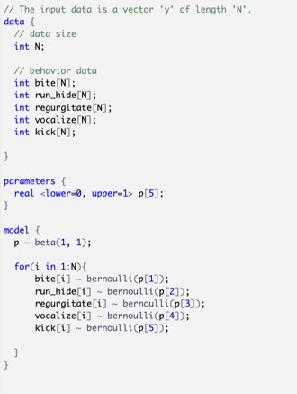
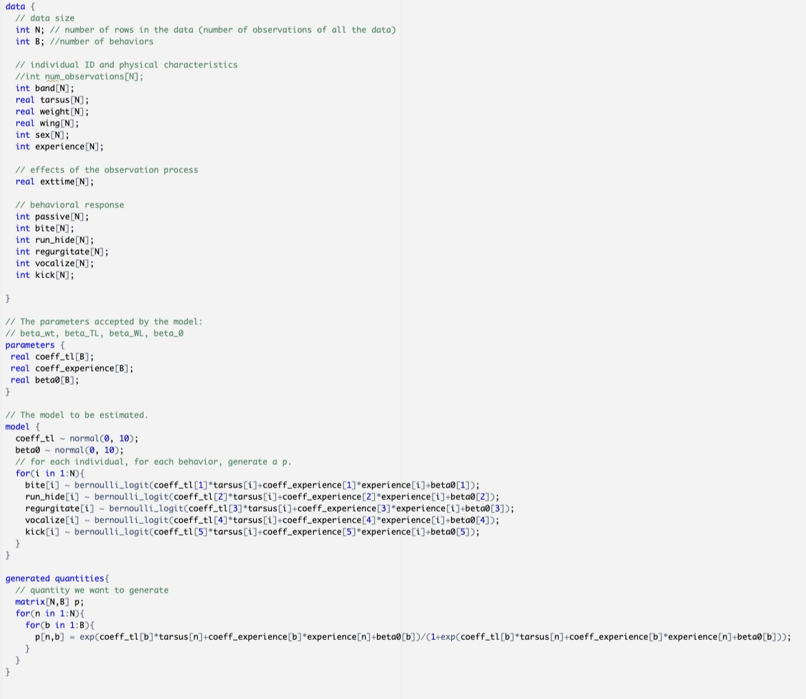
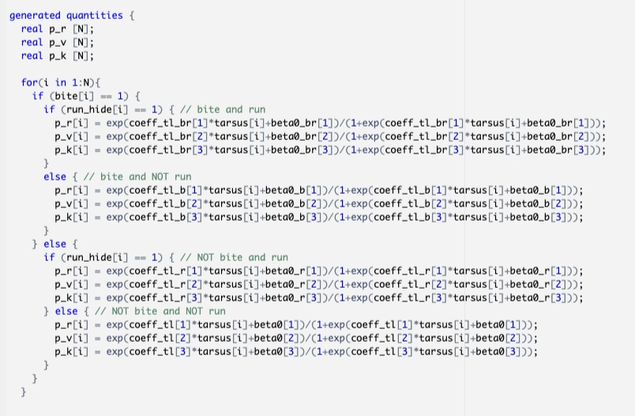

# INTRODUCTION

This project seeks to investigate the relationship between Leach's Storm Petrel's physical characteristics and their responses to being studied.

Leach's Storm Petrels are small, long-lived seabirds that nest in underground burrows on offshore islands. Because storm petrels are long-lived and often return to the same site each year to breed, researchers can study the same individual bird over the course of many years of their life. Kent Island (New Brunswick, Canada) is home to a storm petrel colony that has been studied since at least the 1950s. To study the petrels, researchers "grub": they stick their arms into petrel burrows to feel for birds and eggs, then remove birds for measurement (weight, wing chord length, tarsus length) and banding (so that each bird has a metal ring around its leg with a unique sequence of numbers). Finally, birds are placed back in their burrows.

Perhaps obviously, petrels respond to being grubbed. Moreover, their responses are variable. We wanted to investigate underlying patterns in this variability using behavioral data collected during the 2023 field season and demographic data reaching back to the 1950s.

# SETUP

Our project can be found on the following GitHub page: https://github.com/sprachan/petrel-behavior

For this project, we import the following packages:
```{r, message=FALSE, results='hide'}
library(tidyverse)
library(rstan)
library(patchwork)
library(bridgesampling)
library(loo)
library(corrplot)
```

We begin by inputting our data from a csv.
```{r, results='hide'}
# Load Data --------------------------------------------------------------------
load('./data/behav_ind_raw.RData')
load('./data/behav_ind_summarized.RData')
behav_ind_raw <- mutate(behav_ind_raw,
                        run_hide = run_and_hide + hide)
behav_ind_raw <- na.omit(behav_ind_raw)
attach(behav_ind_raw)

N = length(band)
```

Each row represents one observation/grubbing, where the three physical characteristics (weight, wing length, tarsus length) and five binary behaviors (bite, run, regurgitate, vocalize, kick) are recorded. Experience (the number of times this bird has already been grubbed) is also recorded for each observation.

# EDA

One of the things that we are interested in is the correlation between behaviors, as this may suggest that conditional probabilities will be useful (e.g. if a bird runs, they are more likely to also regurgitate). The strong, negative correlation between bite and run/hide discovered during this EDA is later used to determine the partitioning/branching of our Model 2.

We are also interested in the correlation between physical characteristics. Since we will eventually regress on these variables, we want to make sure they are not too highly correlated. If they are, then it weakens the power of the regressor somewhat artificially. We observed very weak correlation between physcial characteristics, so we are not particularly concerned by this.

```{r}
behavs <- cbind(behav_ind_raw$run_hide,
                behav_ind_raw$regurgitate,
                behav_ind_raw$vocalize,
                behav_ind_raw$kick,
                behav_ind_raw$bite)

phys <- cbind(as.numeric(behav_ind_raw$weight),
              as.numeric(behav_ind_raw$wing_length),
              as.numeric(behav_ind_raw$tarsus_length)) |>
        na.omit()

b <- c('run/hide', 'regurgitate', 'vocalize', 'kick', 'bite')
p <- c('weight', 'wing length', 'tarsus length')

behav_cor <- cor(behavs)
colnames(behav_cor) <- b
rownames(behav_cor) <- b

phys_cor <- cor(phys)
colnames(phys_cor) <- p
rownames(phys_cor) <- p

# 5 chains, 50,000 iterations, get an ESS of 5000 for each parameter before running the BF

corrplot(behav_cor, method = 'color',
         outline = TRUE,
         col = COL2('PRGn'),
         tl.col = 'black')

corrplot(phys_cor, method = 'color',
         outline = TRUE,
         col = COL2('PRGn'),
         tl.col = 'black')

```

# STAN

Now, we are ready to craft our models in STAN.

First, make a model object to feed into our STAN models.
```{r}
# STAN Time --------------------------------------------------------------------
model_obj <- list(B = 5,
                  N = N,
                  band = as.numeric(band),
                  tarsus = as.numeric(tarsus_length),
                  weight = as.numeric(weight),
                  wing = as.numeric(wing_length),
                  sex = as.integer(numeric_sex),
                  experience = as.integer(years),
                  exttime = as.numeric(ext_time),
                  passive = passive,
                  bite = bite,
                  run_hide = run_hide,
                  regurgitate = regurgitate,
                  vocalize = vocalize,
                  kick=kick
)
```

## Model 0: Modeling behaviors as bernoullis
For model 1, we are modeling the each binary behavior as a bernoulli, and are modeling proportion p_b for each behavior b according to a Beta(1,1) distribution. The result is a p_b value for each behavior.



```{r, eval=FALSE}
## MODEL 0 ------
model0 = stan_model('./scripts/m0.stan')
fit0 = rstan::sampling(model0, model_obj, iter = 10000, chains = 1)
params0 = rstan::extract(fit0)
```

## Model_wt, Model_tl, Model_wl, Model_exp: One-parameter logistic regressions
Model_wt, Model_tl, Model_wl, Model_exp are all logistic regressions that take one datapoint of the observations into account (weight, tarsus length, wing length, and experience, respectively). Without loss of generality, our output is: beta0[B] and beta_wt[B].
By using the generated quantities block, we also output 3x3 matrix (iterations x observations x behaviors) for predicted proportion (p_b) values.


As an example, we have included the stan code for M_tl below.


```{r, eval=FALSE}
## MODEL 1(s) ----
exp_model = stan_model('./scripts/m1_experience.stan')
wt_model = stan_model('./scripts/m1_wt.stan')
tl_model = stan_model('./scripts/m1_tl.stan')
wl_model = stan_model('./scripts/m1_wl.stan')
exp_fit = rstan::sampling(exp_model, model_obj, iter = 10000, chains = 1)
wt_fit = rstan::sampling(wt_model, model_obj, iter = 10000, chains = 1)
tl_fit = rstan::sampling(tl_model, model_obj, iter = 10000, chains = 1)
wl_fit = rstan::sampling(wl_model, model_obj, iter = 10000, chains = 1)
params_exp = rstan::extract(exp_fit)
params_wt = rstan::extract(wt_fit)
params_tl = rstan::extract(tl_fit)
params_wl = rstan::extract(wl_fit)
```

Using bayes factors, we can conclude that each of these models is significantly better than M0. In particular, there is extremely high support for M_tl and M_exp (with more support for M_exp). We conclude that experience is the most predictive parameter of a bird's behavior.

```{r, eval=FALSE}
bf.wt_0 <- bayes_factor(bridge_sampler(wt_fit, silent = TRUE),
                        bridge_sampler(fit0, silent = TRUE))

print(bf.wt_0)

bf.tl_0 <- bayes_factor(bridge_sampler(tl_fit, silent = TRUE),
                        bridge_sampler(fit0, silent = TRUE))
print(bf.tl_0)

bf.wl_0 <- bayes_factor(bridge_sampler(wl_fit, silent = TRUE),
                        bridge_sampler(fit0, silent = TRUE))
print(bf.wl_0)

bf.exp_0 <- bayes_factor(bridge_sampler(exp_fit, silent = TRUE),
                         bridge_sampler(fit0, silent = TRUE))
print(bf.exp_0)

bf.exp_tl <- bayes_factor(bridge_sampler(exp_fit, silent = TRUE),
                          bridge_sampler(tl_fit, silent = TRUE))
print(bf.exp_tl)
```

Bayes Factors: \\
M-WT over M0: 20.03071 \\
M-TL over M0: 26796.42961 \\
M-WL over M0: 4.94604 \\
M-EXP over M0: 61798.37316 \\

Note that M-tl and M-exp in particular are the are very highly supported over M0.

## Model 1: Multi-parameter logistic regression
In Model 1, we combine the best of our models above (M_tl and M_exp) into a multi-parameter logistic regression.



```{r, eval=FALSE}
model1 = stan_model('./scripts/m1_comp.stan')
fit1 = rstan::sampling(model1, model_obj, iter = 10000, chains = 1)
params1 = rstan::extract(fit1)
```

Interestingly, this Model 1 was not an improvement on either M_tl or M_exp. Given this information, in future models, we will use tarsus length as our only regression parameter.

```{r, eval=FALSE}
bf.exp_1 <- bayes_factor(bridge_sampler(exp_fit, silent = TRUE),
                         bridge_sampler(fit1, silent = TRUE))
print(bf.exp_1)

bf.tl_1 <- bayes_factor(bridge_sampler(tl_fit, silent = TRUE),
                        bridge_sampler(fit1, silent = TRUE))
print(bf.tl_1)
```

Bayes Factors: \\
M-EXP over M1: 3.92825 \\
M-TL over M1: 1.76285 \\

This is an interesting result. We wouldn't have expected that the combination/addition of more regressors would be a weaker model. Moving forward, we will use the M-tl model as our most supported regressor model.

## Model 2: Partitioning by behavior (BITE and RUN/HIDE)

In Model 2, we introduce a new idea: partitioning the data by several behaviors before modelling. The idea behind this is that whether a bird exhibits one behavior may influence its likelihood of exhibiting certain others (conditional probability). The behaviors we chose to partition by (based on our EDA) were bite and run/hide.
Note that now we are only modelling the remaining three behaviors, so we have to update our model object so that B=3. For each of the four partitions, we output a predicted proportion value for each of the 3 behaviors (for a total of 12 output parameters).


```{r, eval=FALSE}
## MODEL 2 ----
model_obj2 <- model_obj
model_obj2$B <- 3
model2 = stan_model('./scripts/m2.stan')
fit2 = rstan::sampling(model2, model_obj2, iter = 10000, chains = 1)
params2 = rstan::extract(fit2)
```

Based on the bayes factors below, Model 2 outperforms M0 enormously. It also outperforms our leading regression model, M_tl. We will combine M2 and M_tl in M3.

```{r, eval=FALSE}
bf.2_0 <- bayes_factor(bridge_sampler(fit2, silent = TRUE),
                       bridge_sampler(fit0, silent = TRUE))
print(bf.2_0)

bf.2_tl <- bayes_factor(bridge_sampler(fit2, silent = TRUE),
                        bridge_sampler(tl_fit, silent = TRUE))
print(bf.2_tl)
```

Bayes Factors: \\
M2 over M1: 5.46083e+100 \\
M2 over M-TL: 1.898954e+96 \\

## Model 3: Partitioning by behavior with single-parameter regression
In Model 3, we combine the partitioning strategy tested in Model 2 with the logistic regression from Model_tl. We partition again by bite and run behaviors, and then do a logistic regression based on the tarsus length to model each of the remaining three behaviors. Like in Model_tl, we use the generated quantities block to record the prediction proportions (p_b) for each behavior, resulting in a matrix with dimensions (iterations x observations x behaviors).




```{r, eval=FALSE}
## MODEL 3 ----
model3 = stan_model('./scripts/m3.stan')
fit3 = rstan::sampling(model3, model_obj2, iter = 10000, chains = 1)
params3 = rstan::extract(fit3)
```

According to our bayes factors, Model 3 is our best model yet. We were happy to see that this combination outperforms each of Model 2 and M_tl individually.

```{r, eval=FALSE}
bf.3_tl <- bayes_factor(bridge_sampler(fit3, silent = TRUE),
                        bridge_sampler(tl_fit, silent = TRUE))
print(bf.3_tl)

bf.3_2 <- bayes_factor(bridge_sampler(fit3, silent = TRUE),
                       bridge_sampler(fit2, silent = TRUE))
print(bf.3_2)
```

Bayes Factors: \\
M3 over M-TL: 2.041104e+119 \\
M3 over M-2: 2.678111e+22 \\

## PLOTS
We defined some custom plotting functions:
make_param_df is a helper function that takes lists and makes them into data frames for easier use with ggplot.
```{r, eval = FALSE}
make_param_df <- function(list_in, is_probs = FALSE){
  # requires this order in temp
  if(is_probs == TRUE){
    temp <- list('bite' = list_in[1], 
                 'run_hide' = list_in[2],
                 'regurgitate' = list_in[3],
                 'vocalize' = list_in[4],
                 'kick' = list_in[5])
    out <- enframe(temp, name = 'behavior', value = 'value') |>
           unnest_longer(value) |>
           unnest_longer(value)
    return(out)
  }else{
    temp <- list('bite' = list_in[,1], 
                 'run_hide' = list_in[,2],
                 'regurgitate' = list_in[,3],
                 'vocalize' = list_in[,4],
                 'kick' = list_in[,5])
    out <- enframe(temp, name = 'behavior', value = 'value') |>
      unnest_longer(value)
    return(out)
  }
  
}
```


plot_param takes the param_df created in the above function and makes histograms of the parameters generated in STAN. 
```{r, eval = FALSE}
plot_param <- function(list_in, plot_title = NULL, is_probs = FALSE){
  temp <- make_param_df(list_in, is_probs = is_probs)
  if(is_probs == TRUE){
    p <- ggplot(temp)+
      geom_histogram(aes(x = value),
                     bins = 100,
                     fill = 'lightblue',
                     color = 'black',
                     linewidth = 0.25)+
      facet_wrap(facets = vars(behavior),
                 nrow = 5,
                 scales = 'free_y')+
      labs(title = plot_title, x = 'Predicted p', y = 'Count')+
      xlim(c(0,1))
    return(p)
  }else{
    p <- ggplot(temp)+
      geom_histogram(aes(x = value),
                     bins = 100,
                     fill = 'lightblue',
                     color = 'black',
                     linewidth = 0.25)+
      geom_vline(aes(xintercept = 0),
                 linetype = 'dashed',
                 col = '#dd3040')
      facet_wrap(facets = vars(behavior),
                 nrow = 5)+
      labs(title = plot_title, x = 'Value', y = 'Count')
    return(p)
  }
}
```

The following two functions calculate the Mean Squared Error, then plot the results. There is some data wrangling to use these functions together.

```{r, eval = FALSE}
calc_mse <- function(p_list, behavs, num_ind = NULL){
  if(length(dim(p_list)) == 3){
    t <- dim(p_list)[1]
    N <- dim(p_list)[2]
    B <- dim(p_list)[3]
    
    mse <- matrix(NA, nrow = N, ncol = B)
    for(n in 1:N){
      for(b in 1:B){
        x <- behavs[[b]][n]
        prop <- p_list[,n,b]
        mse[n, b] <- (1/t)*sum((prop-x)^2)
      }
    }
  }else if(length(dim(p_list)) == 2){
    t <- dim(p_list)[1]
    B <- dim(p_list)[2]
    
    mse <- matrix(NA, nrow = num_ind, ncol = B)
    for(n in 1:num_ind){
      for(b in 1:B){
        x <- behavs[[b]][n]
        prop <- p_list[,b]
        mse[n, b] <- (1/t)*sum((prop-x)^2)
      }
    }
  }
  mse_df <- data.frame('bite' = mse[,1],
                       'run_hide' = mse[,2],
                       'regurgitate' = mse[,3],
                       'vocalize' = mse[,4],
                       'kick' = mse[,5]) |>
            pivot_longer(cols = everything(),
                         names_to = 'behavior',
                         values_to = 'mse')
  return(mse_df)
}

plot_mse <- function(data_in, plot_title){
  p <- ggplot(data_in)+geom_segment(aes(x = individual, xend = individual,
                                        y = 0, yend = transform_mse))+
       facet_wrap(facets = vars(behavior),
                  nrow = 5)+
    labs(title = plot_title, y = '-log10(MSE)', x = 'Individual')
  return(p)
}

# Data wrangling
mse0 <- calc_mse(params0$p, behavs = behavs, num_ind = 174) |>
        mutate(model = rep('M0', 870),
               individual = rep(seq(1:174), each = 5),
               transform_mse = -log10(mse))
mse1 <- calc_mse(params1$p, behavs = behavs) |>
        mutate(model = rep('M1', 870),
               individual = rep(seq(1:174), each = 5),
               transform_mse = -log10(mse))
mse_exp <- calc_mse(params_exp$p, behavs = behavs) |>
           mutate(model = rep('M_exp', 870),
                  individual = rep(seq(1:174), each = 5),
                  transform_mse = -log10(mse))
mse_tl <- calc_mse(params_tl$p, behavs = behavs) |>
          mutate(model = rep('M_tl', 870),
                 individual = rep(seq(1:174), each = 5),
                 transform_mse = -log10(mse))

# generate plots
plots <- list(M0 = mse0, M1 = mse1, M_exp = mse_exp, M_tl = mse_tl) |>
  imap(plot_mse)
```
We used these functions to generate the attached plots.